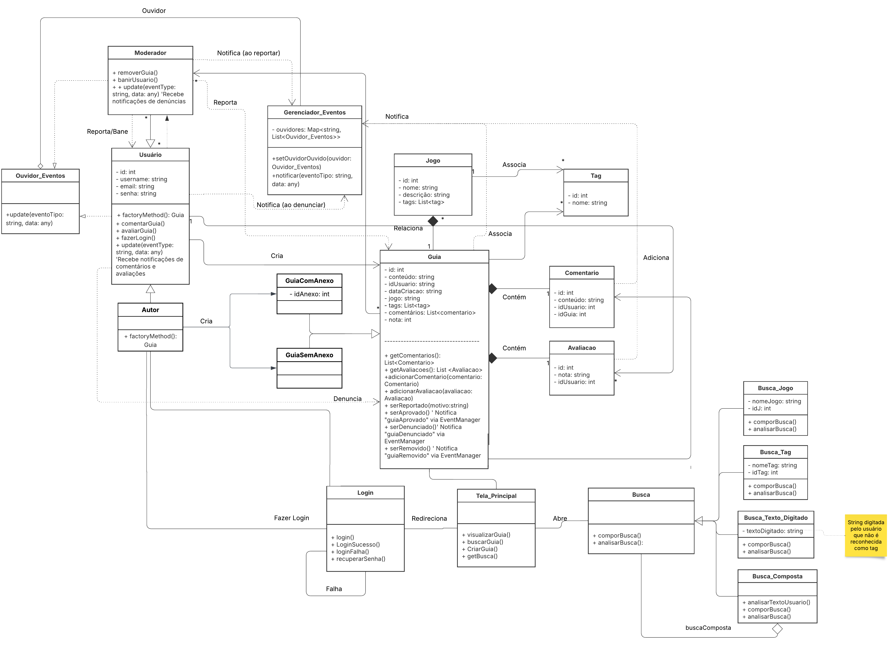

# 3.0. Diagrama de Classes Retrabalhado

## Introdução 

O diagrama de classes é uma maneira de representar o projeto de software por uma perspectiva holística, sendo diretamente relacionado ao modelo de Orientação à Objetos. De acordo com a Linguagem de Modelagem Unificada em Português, "o diagrama de classes demonstra a estrutura estática das classes de um sistema onde estas
representam as "coisas" que são gerenciadas pela aplicação modelada" [(UML Em Português)](#referências). 

A importância de trazê-lo e evidenciá-lo novamente no projeto se dá na implementação devida de GRASPs e GoFs, respectivamente. Padrões de Software de Atribuição de Responsabilidade Geral (*General Responsibility Assignment Software Patterns*), ou GRASPs, são um conjunto de padrões que auxiliam a entender desenhos de objeto essenciais e aplicar raciocínio de uma maneira explicável, metódica e racional [(LARMAN, 2001)](#referências). Um exemplo seria um GRASP criador, estrutura que vai possuir a responsabilidade de criar novas instâncias, determinando relações de dependência e agregação que serão consequências naturais e desenvolvidas no diagrama de classes a partir desse padrão.

Os Padrões de Desenho *Gang of Four*, ou GoFs, são uma coleção de 23 padrões de design do livro *Design Patterns: Elements of Reusable Object-Oriented Software*, de Erich Gamma, Richard Helm, Ralph Johnson e John Vlissides [(KUMAR, 2022)](#referências). Esses padrões são divididos em Criacionais, Estruturais e Organizacionais de acordo com sua função, sendo compostos de combinações e estruturas específicas de GRASPs. Sua utilização em um projeto permite a leitura e entendimento rápido de funções que hierarquias em um projeto de software podem ter, além de aderir à modelos que comprovadamente fornecem estruturas robustas. 

O grupo utilizou como ponto de partida o [diagrama de classes da entrega anterior](https://unbarqdsw2025-1-turma02.github.io/2025.1-T02_G5_BackSeat_Entrega_02/#/Modelagem/2.1.1.DiagramaDeClasses) para trabalhar a base dos GoFs [criacionais](3.1.GoFsCriacionais.md), [estruturais](3.2.GoFsEstruturais.md) e [comportamentais](3.3.GoFsComportamentais.md). O diagrama de classes foi sendo retrabalhado ao longo do desenvolvimento dos GoFs para aplicá-los e melhor representar o projeto como um todo.

## Metodologia

Ao longo do desenvolvimento da terceira entrega, o diagrama de classes desenvolvido na [segunda](https://unbarqdsw2025-1-turma02.github.io/2025.1-T02_G5_BackSeat_Entrega_02/#/README) foi sendo retrabalhado para servir como base à implementação dos padrões de projeto. 

A metodologia abordada se consolidou quando o grupo decidiu em trabalhar nos GoFs Factory Method, Composite e Observer pela sua aderência com o planejamento inicial do projeto, a partir do qual o trabalho no Diagrama de Classes foi feito para a realização dos GoFs.

É de nota que os GoF criacional [Factory Method](3.1.GoFsCriacionais.md) e estrutural [Composite](3.2.GoFsEstruturais.md) foram sendo trabalhado na plataforma [LucidChart](https://www.lucidchart.com/pages) ao longo da semana de 26 de maio, e diversas dúvidas foram tiradas em relação à sua implementação, garantindo que faça sentido dentro da estrutura do projeto. O GoF organizacional [Observer](3.3.GoFsComportamentais.md) foi implementado pela ferramenta [manus.ia](https://manus.im/guest), que permite a realização de um gráfico perante um código base. O GoF criacional então foi retabalhado para entrar neste diagrama de classes.

A figura 1, a seguir, representa o diagrama de classes retrabalhado com a implementação dos GoFs. 

**OBS**: Event_Manager e Event_Listener foram traduzidos para Gerenciador_Eventos e Ouvidor_Eventos, mas não temos certeza ainda se eles ficarão na versão traduzida ou em inglês durante o desenvolvimento do código.

**Figura** 1: Diagrama de classes retrabalhado. **Autor**: Rodrigo Orlandi

## Conclusão

Ainda há elementos para melhorar, como a inconsistência do nome Gerenciador_Eventos/Event_Manager, mas a utilização do diagrama de classes e de seu retrabalho permitiu ao grupo se guiar para a implementação dos GoFs. 

O planejamento individual dos GoFs está detalhado nos respectivos documentos, como quais GoFs de cada tipo foram considerados, e retrabalhos ao longo do caminho.

## Referências 

1. **UML - Linguagem de Modelagem Unificada Em Português**. Autor(a) desconhecido(a). Disponível em [https://aprender3.unb.br/pluginfile.php/3070937/mod_page/content/1/Material%20Complementar%20T%C3%B3pico%202%20-%20DSW%20-%20Modelagem%20A.zip](https://aprender3.unb.br/pluginfile.php/3070937/mod_page/content/1/Material%20Complementar%20T%C3%B3pico%202%20-%20DSW%20-%20Modelagem%20A.zip). Acesso em: 29 mai. 2025.

2. LARMAN, Craig. **Applying UML and Patterns**; An Introduction to Object-Oriented Analysis and Design and the Unified Process. 2 ed. 627 p, página 216. Disponível em: [https://personal.utdallas.edu/~chung/SP/applying-uml-and-patterns.pdf](https://personal.utdallas.edu/~chung/SP/applying-uml-and-patterns.pdf). Acesso em: 29 mai. 2025. 

3. KUMAR, Pankaj. **TRANSPLANTE de introdução**. *In*: Digital Ocean, 2022. Disponível em: [https://www.digitalocean.com/community/tutorials/gangs-of-four-gof-design-patterns](https://www.digitalocean.com/community/tutorials/gangs-of-four-gof-design-patterns). Acesso em: 29 mai. 2025.

## Histórico de Versão

| Versão | Alteração                  | Responsável     | Revisor | Data       | Detalhes da Revisão |
| -      | -                          | -               | -       | -          | -                   |
| 1.0    | Elaboração do documento | [Rodrigo Orlandi](https://github.com/)| | 02/06/2025 | |
