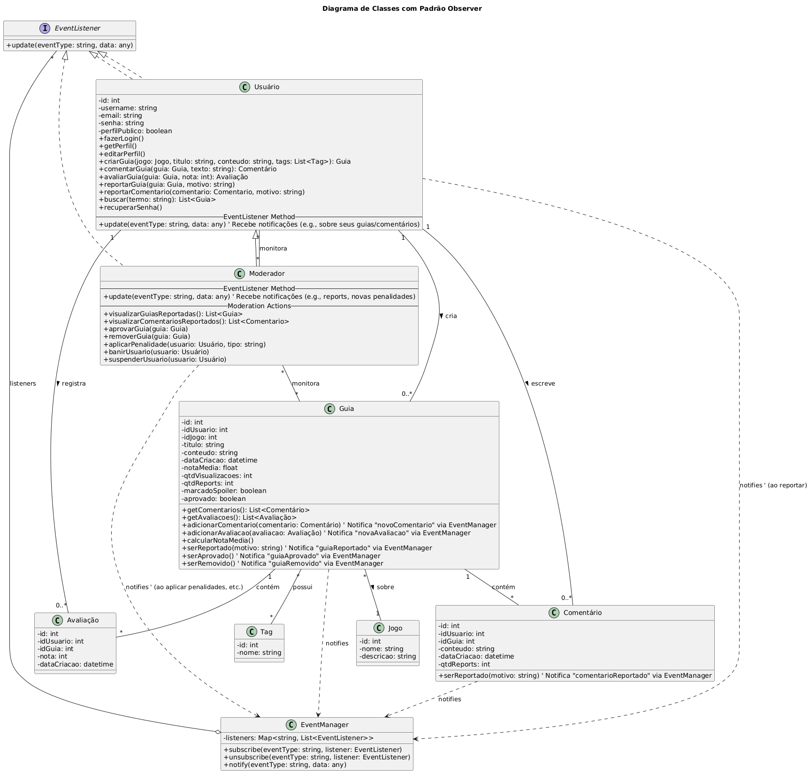

# 3.3. Módulo Padrões de Projeto GoFs Comportamentais

Foco_3: Padrões de Projeto GoFs Comportamentais.

## Introdução

No desenvolvimento de sistemas que envolvem múltiplos atores (usuários, moderadores, autorias de conteúdo), torna‐se imprescindível haver um mecanismo de notificação eficiente e desacoplado. Nesse contexto, o Padrão Observer (GoF, 1995) apresenta‐se como uma solução amadurecida para tratar essa comunicação “um para muitos” sem introduzir acoplamento rígido entre os componentes. Uma equipe de 2 a 3 desenvolvedores pode colaborar de forma organizada: enquanto um membro foca no projeto de classes (modelagem), outro cuida da implementação dos métodos de notificação e um terceiro revisa a consistência de regras de negócio. Esse fluxo de trabalho, aliado a um revisor dedicado, garante aderência às boas práticas de design e reduz retrabalho (Gamma et al., 1995; Fowler, 2004; Parnas, 1972).

Atualmente, nosso sistema de guias permite que usuários publiquem conteúdos (Guias), outros usuários comentem ou avaliem esses guias, e moderadores analisem denúncias. Porém, o modelo de notificação é manual e disperso: cada vez que um comentário ou denúncia ocorre, o código atual faz um SELECT direto ao banco e decide “na unha” quem deve ser avisado, resultando em alto acoplamento e lógica repetida em vários pontos da aplicação. Além disso, sempre que novos tipos de notificações são necessários (por exemplo, “edição de guia suspensa” ou “guia marcado como spoiler”), devemos alterar diversas camadas de código simultaneamente, o que aumenta a probabilidade de bugs e dificulta a testa-bilidade.

Além disso, a adoção do Observer permitirá centralizar a lógica de notificação em um único componente — o EventManager —, evitando dispersão de SQL e regras de encaminhamento em camadas de serviço distintas. Com essa reorganização, cada classe de domínio (por exemplo, Guia, Comentário e Avaliação) simplesmente disparará eventos relevantes (como “novoComentario” ou “guiaReportado”), sem conhecer quem receberá tais notificações. Dessa forma, o autor do guia receberá alertas imediatos sobre interações em seu conteúdo, e os moderadores serão notificados automaticamente sempre que uma denúncia for registrada, garantindo maior coesão e isolamento de responsabilidades. Essa abordagem não apenas facilita a manutenção e evolução do sistema (ao adicionar novos tipos de evento), mas também melhora a rastreabilidade das ações dos usuários e moderadores, tornando o código mais legível e testável.

## Metodologia
Inicialmente a equipe estava em busca de um GoF Comportamental, e nessa entrega, o grupo decidiu que usaria o padrão comportamental observer, por ter uma maior compatibilidade com o projeto, mais especificamente com o sistema de notificações planejado para o usuário e o moderador. 

A imagem a seguir, é a representação do nosso Diagrama GoF Comportamental:

Esse padrão permite que, sempre que um Guia for comentado, avaliado ou denunciado, os interessados (autor do Guia e Moderadores) recebam atualizações, sem acoplamento rígido entre os objetos. Além disso, o Observer facilita a extensão futura de novos tipos de evento, sem exigir modificações em múltiplas camadas de código, atendendo assim às necessidades de notificações para Usuário e Moderador.

O EventManager, como o próprio nome já diz, é responsável pela gerência dos eventos que ocorrem com o guia, conduzindo a notificação de eventos como "comentários e avaliações", para o usuário, e eventos do tipo "denúncia", para os moderadores.  

O guia foi aualizado com métodos de ser denunciado, receber avaliações e comentários, e as classes "Usuário" e "Moderador" receberam o método de ouvir o evento, ou seja, forem notificados de avaliações ou comentários e denúncias, respectivamente.

## Conclusão/Senso Crítico

## Referências 

- Gamma, E.; Helm, R.; Johnson, R.; Vlissides, J. Design Patterns: Elements of Reusable Object‐Oriented Software. Addison‐Wesley, 1995.

- Fowler, M. Patterns of Enterprise Application Architecture. Addison‐Wesley, 2004.

- Parnas, D. On the Criteria To Be Used in Decomposing Systems into Modules. Communications of the ACM, 1972.

## Histórico de versão:

| Versão | Alteração                  | Responsável     | Revisor | Data       | Detalhes da Revisão |
| -      | -                          | -               | -       | -          | -                   |
| 1.0    | adição pacotes, colaboração | [Júlio Cesar](https://github.com/Julio1099), [Fernando Gabriel](https://github.com/show-dawn) e [João Paulo](https://github.com/joaombc) | | 27/05/2025 | |
| 1.1    | Adição de metodologia  | [Joao Victor Marques](https://github.com/jmarquees), [Vitor Carvalho](https://github.com/vcpVitor) e [Rodrigo Orlandi](https://github.com/orlandirodrigo) | | 01/06/2025 | |
