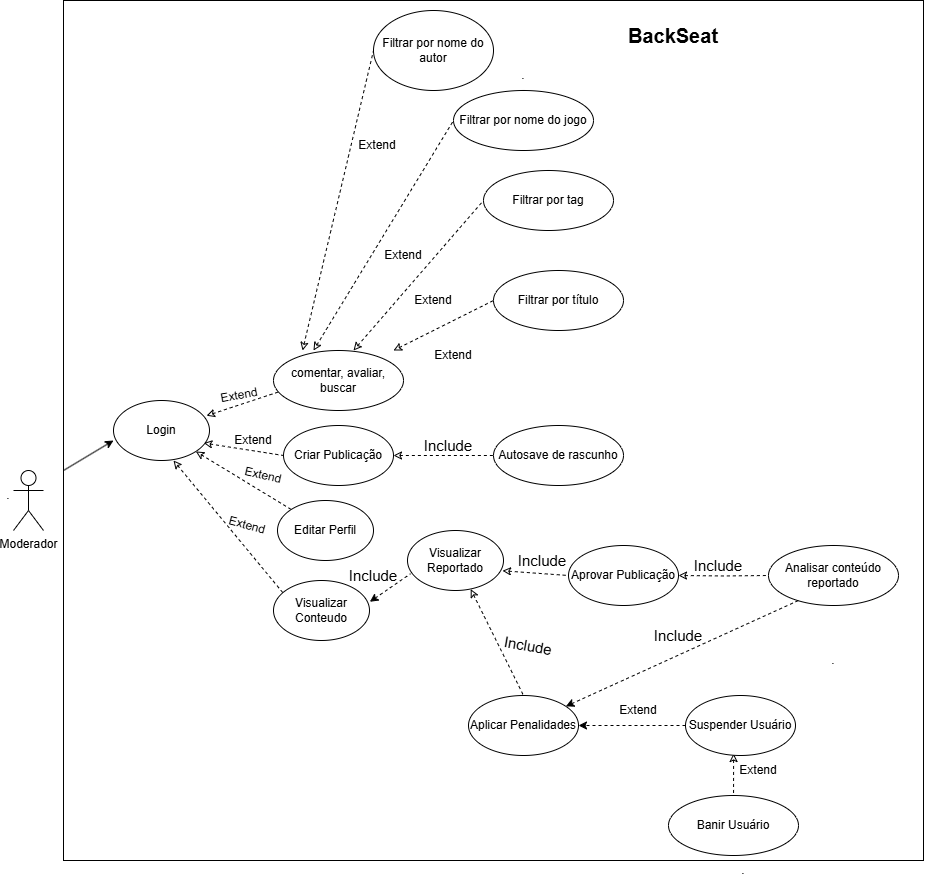

# 3.5. Iniciativas Extras (Padrões de Projeto)

Breve relato sobre as Iniciativas Extras realizadas pela equipe, no escopo da   entrega 3.

1) Foi realizado uma reescrita do documento [Diagrama de Pacotes](PadroesDeProjeto/Iniciativas_extras/Diagrama_de_Pacotes_UML.md) para maior adequação com os padrões da professora;
2) Foi realizado uma reescrita do documento [Diagrama de Colaboração](PadroesDeProjeto/Iniciativas_extras/Diagrama_de_Colaboracao_UML.md) para maior adequação com os padrões da professora;
3) Foi documentada a metodologia de trabalho da equipe nesta entrega, disponível no documento de [Metodologia de Trabalho];(PadroesDeProjeto/Iniciativas_extras/metodologia_trabalho.md).
4) Foram corrigidos o [protótipo](PadroesDeProjeto/Iniciativas_extras/Prototype.md) e [plano de Risco](PadroesDeProjeto/Iniciativas_extras/Plano_de_Risco.md);
5) Foi realizado ajustes no diagrama caso de uso admin para maior adequação com as regras do diagrama de caso de uso, visto abaixo:

-----------------------------------------------------------------------------------------

**Figura 1**: Diagrama de Caso de Uso Admin (Corrigido). **Autores**: Fernando Gabriel, Júlio Cesar e Matheus Ferreira

-----------------------------------------------------------------------------------------

## Histórico de Versão:

| Versão | Alteração                  | Responsável     | Revisor | Data       | Detalhes da Revisão |
| -      | -                          | -               | -       | -          | -                   |
| 1.0    | Adição pacotes, colaboração | [Júlio Cesar](https://github.com/Julio1099) e [Fernando Gabriel](https://github.com/show-dawn)| | 27/05/2025 | |
| 1.1    | Alteração nomes e layout | [Júlio Cesar](https://github.com/Julio1099) e [Fernando Gabriel](https://github.com/show-dawn)| | 27/05/2025 | |
| 1.2    | Adição de doc de metodologia de trabalho, pouco de navegabilidade | [Rodrigo Orlandi](https://github.com/OrlandiRodrigo) |  [Rodrigo Gontijo](https://github.com/rodrigogontijoo) | 02/06/2025 | Alguns links quebrados |
| 1.3    | Correção dos hyperlinks | [Rodrigo Gontijo](https://github.com/rodrigogontijoo)| | 02/06/2025 | |
| 1.4    | Reestruturação da página e colocando legenda na imagem | [Rodrigo Gontijo](https://github.com/rodrigogontijoo)| | 02/06/2025 | |

