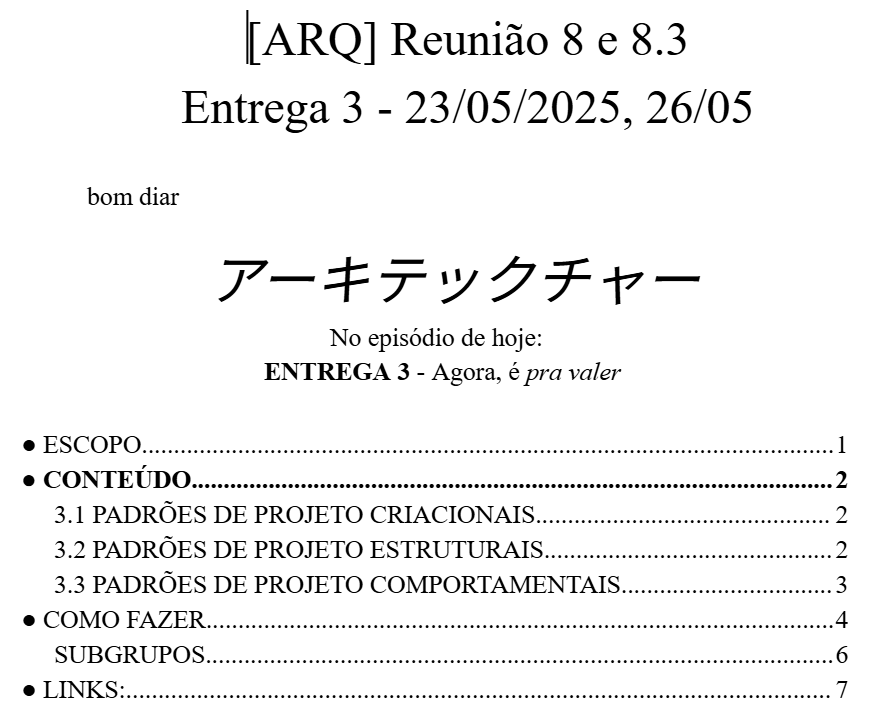
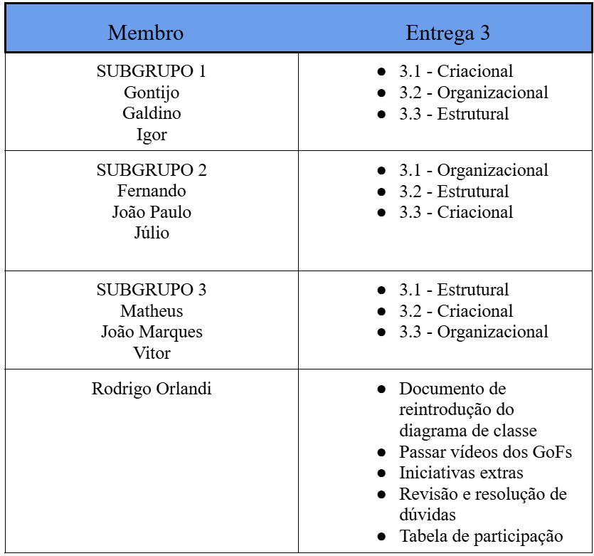
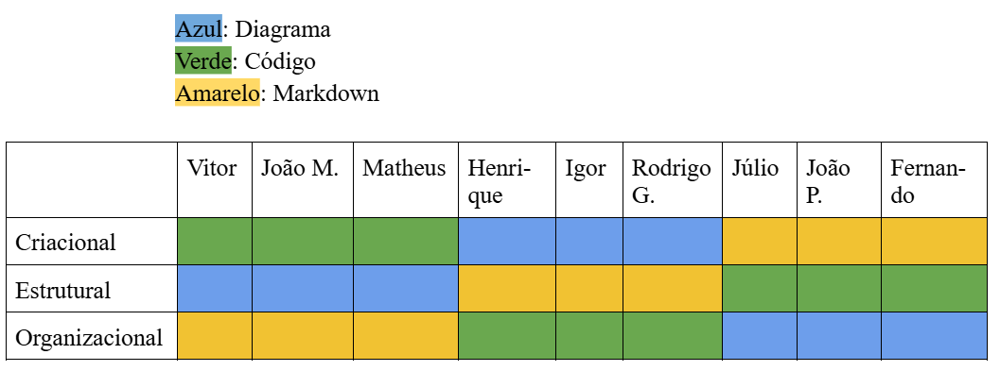

# Iniciativa Extra - Metodologia de Trabalho

## Introdução 
Este documento detalha a metodologia de trabalho de equipe durante a entrega 3, disponibiliza os documentos de apoio trabalhados pela equipe e esclarece a organização realizada entre os membros. Está agrupado juntamente às [iniciativas extras](../3.5.IniciativasExtras.md) da equipe.

## Metodologia
Visando cumprir primariamente uma entrega mínima de qualidade, e para garantir que todos os membros da equipe trabalharam em todos os focos, foi estabelecido um documento no Google Drive respectivo à entrega 3, o qual foi continuamente iterado paralelamente ao desenvolvimento das partes da entrega 3. O documento pode ser acessado via [este link](https://docs.google.com/document/d/1-ja98Rvvdi68BiznqZlR82bOv1W5AsOCe052NFqRMWI/edit?usp=sharing).

O documento foi dividido em diversas seções, relativas à como elaborar o projeto, em quais GoFs iríamos focar, possíveis ideias e organização de trios e da equipe.

**Figura 1**: Introdução do documento de acompanhamento. **Autor**: Rodrigo Orlandi

O principal elemento a destacar do documento é a divisão em trios realizada para garantir a participação de todos os membros em todos os focos. Foi decidido que dividíriamos o grupo em trios para facilitar o trabalho, e um ficaria tratando de documentos relacionados, ajudaria a elaborar, e resolveria dúvidas ao longo do projeto, verificando o progresso da equipe e garantindo que a rotação funcione ao reunir com os membros e explicar o funcionamento do GoF atual. 

A figura 2, a seguir, demonstra a divisão realizada em trios, e a figura 3 demonstra a organização em que parte do foco o trio iria contribuir. 

**Figura 2**: Divisão dos trios e focos gerais. **Autor**: Rodrigo Orlandi

**Figura 3**: Divisão das tarefas por foco e membro. **Autor**: Rodrigo Orlandi

## Conclusão
A organização necessária para cumprir as demandas crescentes da matéria aumenta paralelamente com cada entrega. Este arquivo detalhou a maneira em que o grupo se organizou e trabalhou para poder cumprir o que foi requisitado, ao menos na entrega mínima, visto que na entrega anterior, houve o problema oposto de trabalharmos em elementos excessivos, que acabaram ficando de baixa qualidade.

A organização atual é um resultado das adaptações constantes da equipe conforme o feedback da professora Milene e nosso trabalho anterior. Estamos lentamente melhorando a comunicação e trabalho em equipe, com o propósito deste documento sendo justamente ilustrar nosso progreso organizacional durante a matéria.

## Referência

1. ORLANDI, Rodrigo. **Documento de acompanhamento da Entrega 3**. Disponível em: [https://docs.google.com/document/d/1-ja98Rvvdi68BiznqZlR82bOv1W5AsOCe052NFqRMWI/edit?usp=sharing](https://docs.google.com/document/d/1-ja98Rvvdi68BiznqZlR82bOv1W5AsOCe052NFqRMWI/edit?usp=sharing) Acesso em: 02/06/2025.

## Histórico de Versão

| Versão | Alteração                  | Responsável     | Revisor | Data       | Detalhes da Revisão |
| -      | -                          | -               | -       | -          | -                   |
| 1.0    | Elaboração do documento | [Rodrigo Orlandi](https://github.com/OrlandiRodrigo)| [Rodrigo Gontijo](https://github.com/rodrigogontijoo) | 02/06/2025 | Alguns links quebrados |
| 1.1    | Correção dos hyperlinks | [Rodrigo Gontijo](https://github.com/rodrigogontijoo)| | 02/06/2025 | |
